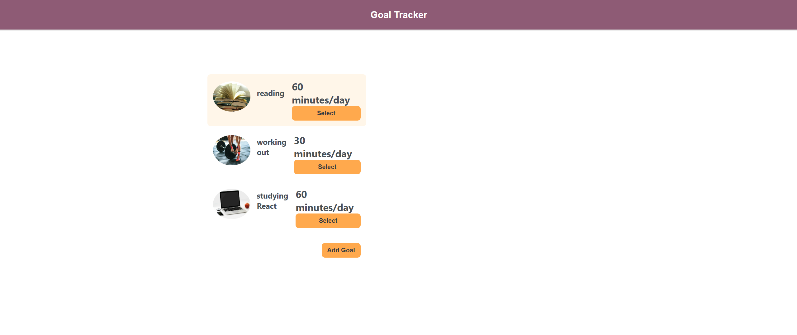

# Goal Tracker App

In addition to utilizing new React skills that I learned, I also implemented an UUID id for each element in the array. Auto-incremented id's are simpler to implement, but using UUIDs makes this application ready for the challenges of scale, complexity, and reliability. Since my ultimate goal is to become a React developer, I try to use industry-standard practices to solve issues I encounter even in very simple projects.

This is how the website looks in the beginning:

Now, we want to add another goal by clicking "Add Goal". Note that the "Add Goal" button changes to "Close" when the form is opened:

We add painting as another activity, and od course, include the motivational image.

Next, we want to change our goal for working out from 30 to 60 minutes/day. We can update the information by clicking on the "Select" button. Note that the form where we update the info doesn't use the general "Upadte Norm", but instead "Update {activityName} norm"

